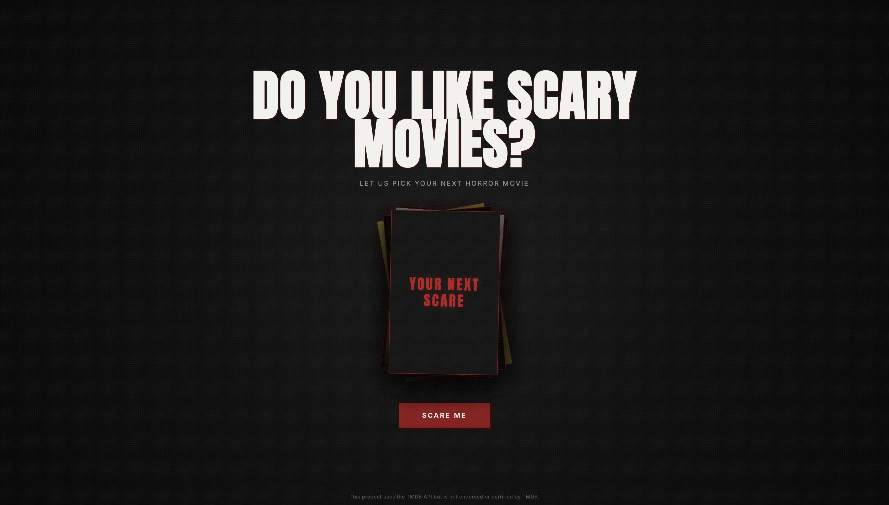
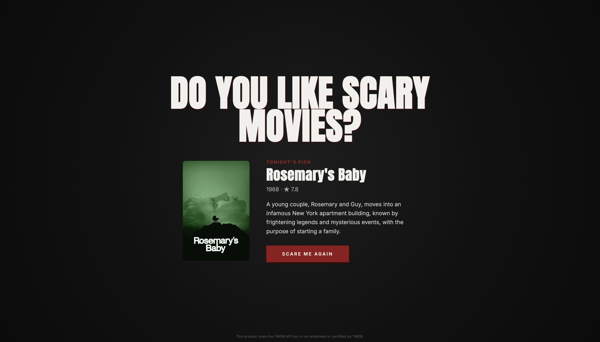

# SCARE ME

> Do you like scary movies?

## Live Demo

[View SCARE ME live](https://scare-me.vercel.app/)

SCARE ME is a horror movie picker for those nights when you don't know what to watch.

Press **SCARE ME** and the app randomly selects a horror movie, complete with its poster, release year, rating and overview.

## Preview

## Features

- Random horror movie selection
- Movie data and posters from TMDB
- Shuffle animation before revealing the movie
- Prevents the same movie from being picked twice in a row
- Responsive design
- Custom horror-inspired UI and cursor

## Built with

- TypeScript
- Vite
- HTML
- CSS
- TMDB API

## About the project

SCARE ME is a personal frontend project created to practice working with external APIs, TypeScript and interactive UI design.

The visual direction is inspired by 90s slasher movies and analog horror, with a dark cinematic interface.

## TMDB

This product uses the TMDB API but is not endorsed or certified by TMDB.
